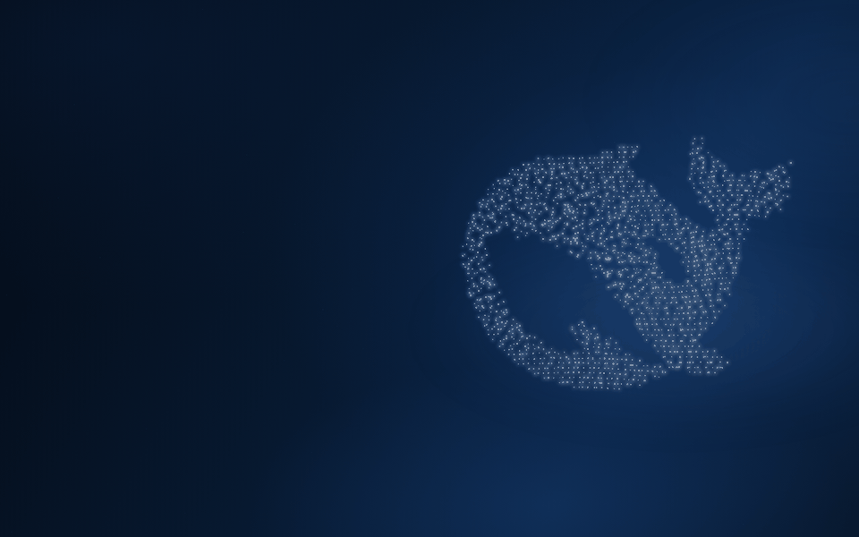
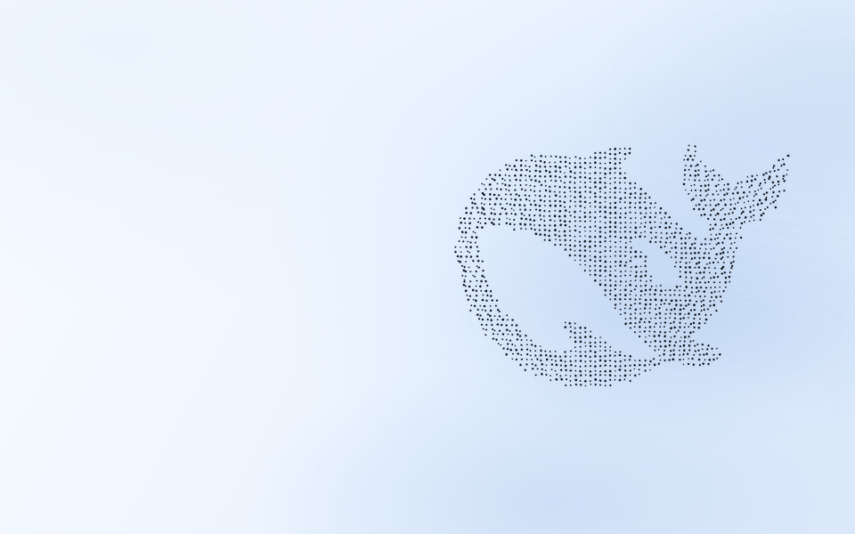
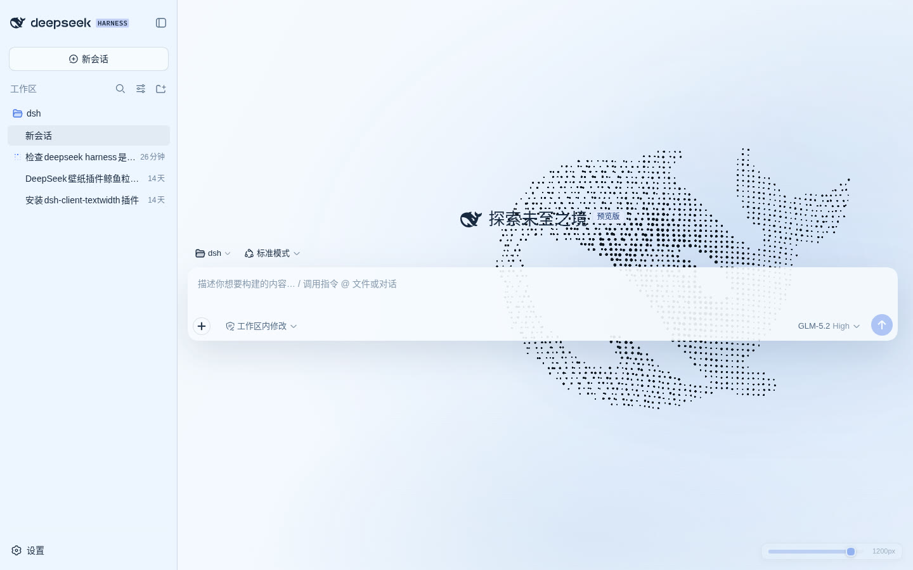
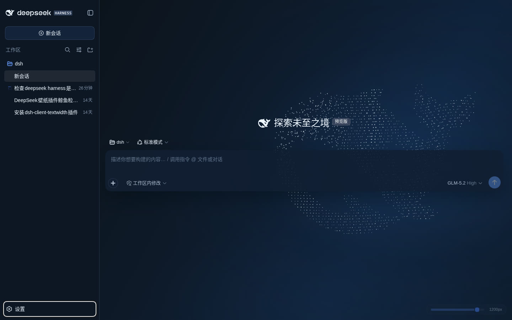
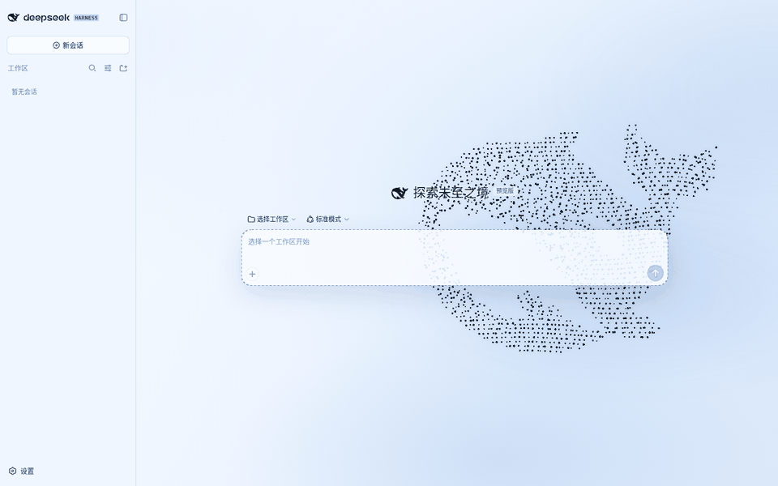
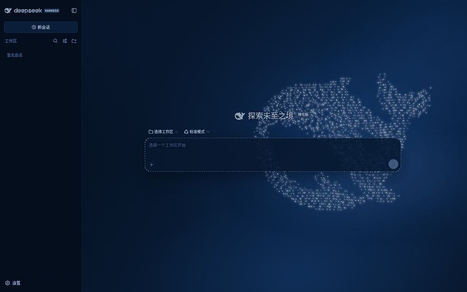

# Harness Whale Wallpaper

面向 DeepSeek Harness Web UI 的本地壁纸插件。它保留 Harness 视觉中最有识别度的点阵鲸鱼，并用克制的钴蓝、薄雾和少量浮尘衬托；没有品牌字样、粒子连线或碰撞特效。

## 效果演示

浅色与深色模式均为动态壁纸：鲸鱼持续呼吸、缓慢转身，雾层漂移；指针划过鲸鱼时，周围粒子产生液态涡流与向外扩散的径向亮度波，离开后柔和归位。下方 GIF 录自独立预览页（2 倍速，实际节奏更舒缓）。

### 深色模式



### 浅色模式



### 真实 Harness 界面

以下素材采集自插件实际部署的 DeepSeek Harness Web UI：壁纸层位于应用框架下方，侧栏、会话画布与输入区照常使用，指针划过时粒子在界面背后绕流。

| 浅色界面 | 深色界面 |
| --- | --- |
|  |  |

浅色界面动效：



深色界面动效：



## 行为

- 鲸鱼轮廓直接采样自仓库中的 `favicon.svg` 路径，WebGL2 默认约 1,750 个规则网格点。
- 约 11 秒的纵向呼吸、29 秒缓慢转身，并叠加尾鳍游动与轻微浮沉；鼠标带来约 6° 视差、位置偏移和向外扩散的局部亮度波。
- 指针进入鲸鱼时，约 160px 半径内的粒子产生连续液态涡流与轻微、正负交替的径向波，范围内部不会形成空洞；离开后约 650ms 柔和归位。原始点阵不被修改。
- 跟随 Harness 通用设置中的“浅色 / 深色 / 跟随系统”：深色保持白色→冰蓝粒子，浅色鲸鱼使用高对比冷调墨黑 `#050b14`，并同步切换界面语义 Token、雾层与背景。
- 明暗模式都透出应用框架与会话画布的全屏底色层；侧栏、输入框、对话内容和设置窗口仍保留各自表面，避免全屏蒙层洗淡底部点阵。
- 无会话时保持完整亮度；打开会话后降至 72%；输入或任务运行时至少保留 34% 亮度（仍尊重更高的 `activeDimming` 配置），过渡约 600ms。
- 页面隐藏时暂停；`prefers-reduced-motion: reduce` 下完全静止。
- DPR 上限为 1.5，`auto` 会在持续掉帧后从 high 依次降到 medium / low。
- WebGL2 不可用时自动显示静态 Canvas2D 点阵鲸鱼。
- 插件卸载或热替换时移除全部 DOM、CSS、事件和动画，并恢复 Harness 原主题。

## 安装到 Harness 3080

要求当前 DeepSeek Harness dev-preview 与 `web` profile。工作目录只作为源码与备份；运行时使用复制到 profile 公共模块目录的实体包，不依赖源码路径或软链接。

先构建正式包：

```bash
pnpm install
pnpm build
pnpm pack --pack-destination /tmp
```

把 tarball 中的 `package/` 内容解压到：

```text
/home/river/.dsh/profiles/node_modules/dsh-plugin-harness-whale
```

然后在 `/home/river/.dsh/profiles/web/cordis.patch.yml` 的 `insert` 列表注册：

```yaml
- insert:
    - id: harness-whale-wallpaper
      name: dsh-plugin-harness-whale
      config:
        enabled: true
        quality: auto
        brightness: 0.9
        scale: 1
        interactionStrength: 1
        activeDimming: 0.22
```

重启 `dsh web` 后刷新 [http://127.0.0.1:3080](http://127.0.0.1:3080)。客户端入口通过公开的 `shell.overlay` 槽位参与生命周期，壁纸绘制层位于应用框架下方，不会阻挡 Harness 控件。

更新本地代码后重新构建并覆盖上述实体包，再重启 Harness。卸载时从 `cordis.patch.yml` 移除注册项，并删除对应实体包目录。

`dsh plugin --profile web add .` 适合本地开发，但会在 profile 中记录指向当前源码目录的 `link:` 依赖；本项目的常驻部署不使用该方式。

## 配置

安装后可在 profile 组合层覆盖插件行。默认值见 `cordis.patch.yml`：

| 字段 | 默认值 | 含义 |
| --- | ---: | --- |
| `enabled` | `true` | 是否启用壁纸与主题 |
| `quality` | `auto` | `auto` / `low` / `medium` / `high` |
| `brightness` | `0.9` | 鲸鱼亮度，范围 0.35–1.4 |
| `scale` | `1` | 鲸鱼比例，范围 0.72–1.25 |
| `interactionStrength` | `1` | 视差、局部亮度与粒子绕流强度，范围 0–1.5 |
| `activeDimming` | `0.22` | 输入/运行状态的不透明度，范围 0.12–0.6 |

配置由宿主侧 Schemastery 校验，并通过同源只读端点提供给客户端。开发预览的公共槽位或必要服务缺失时，插件会记录明确错误并安全停止。

## 独立预览与开发

```bash
pnpm build
python3 -m http.server 4173
```

打开 `http://127.0.0.1:4173/`。`src/renderer.ts` 是插件与预览共享的唯一渲染内核；`lib/` 和 `preview.js` 是构建产物。

## 兼容范围

当前目标为 `@deepseek-ai/dsh 0.1.1-rc.2` 的浏览器 Web UI。Harness 仍处于 dev-preview，若未来改变 `dsh.client`、`ctx.theme` 或 `shell.overlay` 协议，需要重新核对兼容性。

## License

MIT
